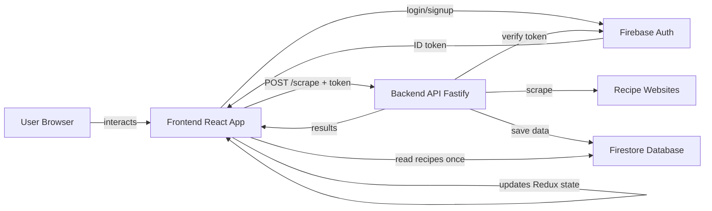
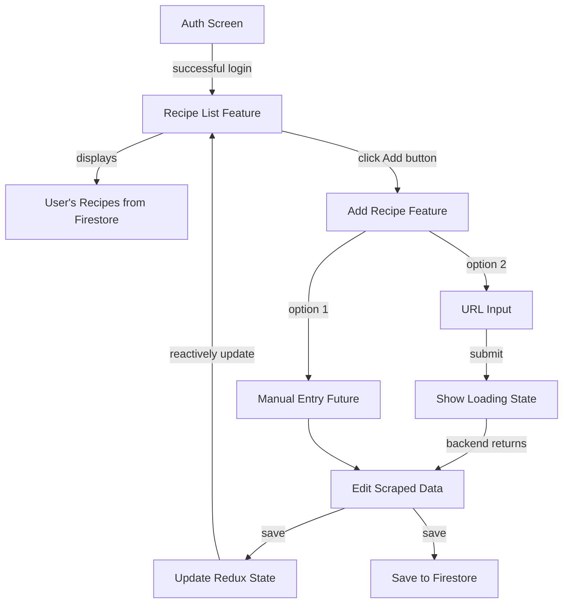

# Recipe App Monorepo - Project Plan

**Project Location**: `/Users/benjamin.drucker/WebstormProjects/lists/`

## Overview

Create a new monorepo with:
- **Frontend**: React 19 + Redux Toolkit + TypeScript + Vite
- **Backend**: Fastify + TypeScript + Firebase Admin
- **Auth**: Firebase Authentication
- **Database**: Firestore
- **Purpose**: Recipe scraping app with URL-based recipe extraction

## Project Structure

```
lists/
├── frontend/          # React app
│   ├── src/
│   │   ├── features/
│   │   │   ├── auth/           # Login/signup
│   │   │   ├── recipe-list/    # Display recipes
│   │   │   └── add-recipe/     # Add/edit recipes
│   │   ├── firebase/           # Firebase config
│   │   ├── common/             # Shared utilities
│   │   └── main.tsx
│   ├── package.json
│   └── vite.config.ts
├── backend/           # Fastify API
│   ├── src/
│   │   ├── middleware/
│   │   ├── routes/
│   │   ├── services/
│   │   └── index.ts
│   ├── package.json
│   └── .env
├── firestore.rules    # Firestore security rules
├── firestore.indexes.json  # Firestore indexes (optional)
└── README.md
```

## Architecture

### System Architecture Overview



### UI Flow



### Data Flow (Text)

**Initial Setup**:
```
User Login → Firebase Auth → Get ID Token
    ↓
Recipe List (load from Firestore once) → Store in Redux
    ↓
Click "Add Recipe" → Navigate to Add Recipe Feature
```

**Path A: Manual Entry** (no backend):
```
User Fills Out Form Manually → Enter ingredients with structured data
    ↓
Save → Update Redux + Write to Firestore directly
    ↓
Navigate Back → Recipe List (shows new recipe instantly)
```

**Path B: URL Scraping** (with backend):
```
Enter URL → Submit → POST /scrape (with token)
    ↓
Backend: Verify Token → Scrape URL → Parse ingredients → Save to Firestore → Return Data
    ↓
Frontend: Display in Editable Form (pre-filled from scrape)
    ↓
User Edits → Save → Update Redux + Update Firestore
    ↓
Navigate Back → Recipe List (shows new recipe instantly, no Firestore read)
```

### Cost Optimization Strategy

**Firestore Read Minimization**:
- Load all user recipes **once** on app mount/login
- Store in Redux for entire session
- All CRUD operations update Redux immediately
- UI reacts to Redux changes, not Firestore listeners
- Only read from Firestore on fresh page load

## Frontend Features

**Design Requirements**:
- ✅ **Responsive Design**: Must work on mobile devices (phones and tablets)
- ✅ **Touch-Friendly**: All interactive elements sized and positioned for touch input
- ✅ **No Hover-Dependent Features**: Always-visible controls instead of hover-only UI
- ✅ **Mobile-First CSS**: Using flexible layouts, proper viewport settings, and touch feedback

### 1. Auth Feature (`src/features/auth/`)
- Login and signup screens
- Adapted from groups app pattern
- Firebase authentication flow
- Google sign-in support

### 2. Recipe List Feature (`src/features/recipe-list/`)
- Displays user's recipes from Redux state
- Empty state message when no recipes
- "Add Recipe" button → navigates to add-recipe
- Delete button on each recipe card (with confirmation)
- Click recipe card to edit
- Sign out button in header
- Reactively updates when Redux state changes
- **Mobile Features**: Always-visible delete buttons, touch-friendly card sizes

**Components**:
- `RecipeList.tsx` - Main container
- `RecipeListHeader.tsx` - Header with add button
- `RecipeListItem.tsx` - Individual recipe display

### 3. Recipe Feature (`src/features/recipe/`) - Add/Edit
- **Two input modes**:
  1. **Manual Entry**: Users can create recipes directly (without backend)
  2. **URL Scraping**: Input URL → backend scrapes → pre-fills form
- Toggle between manual and URL modes
- Loading/progress indicator during scraping
- Editable form fields:
  - Title
  - Description
  - Ingredients (structured with amount, unit, name)
  - Instructions
  - (Future: image, servings, prep/cook time, tags)
- Save button → updates Redux + writes to Firestore directly
- Navigate back to list after save
- **Edit Mode**: Load existing recipe and update instead of create
- **Mobile Features**: Touch-friendly form inputs, proper keyboard handling

**Components**:
- `AddRecipe.tsx` - Main container with mode toggle
- `RecipeForm.tsx` - Editable form fields (shared for both modes)
- `IngredientInput.tsx` - Structured ingredient entry component
  - Options: Simple text input (then parse) OR structured form fields
- `slice.ts` - UI state (loading, errors, mode)

**Ingredient Input Options**:
1. **Simple Text + Parse**: User types "1/2 cup diced carrots", frontend parses into structured format
2. **Structured Form**: Separate fields for amount, unit, name
3. **Hybrid**: Text input with autocomplete/suggestions for unit and ingredient name

**Note**: Frontend writes directly to Firestore for manual entry. Backend only used for scraping.

### Redux State Management

**Central Recipes Slice** (`src/common/slices/recipes.ts`):
```typescript
interface RecipesState {
  recipes: Recipe[];
  loading: boolean;
  error: string | null;
}

// Actions:
- loadRecipes() - Load from Firestore once
- addRecipe() - Add to state + Firestore
- updateRecipe() - Update in state + Firestore
- deleteRecipe() - Remove from state + Firestore
```

## Firestore Data Model

### Collections & Documents

**Collection**: `recipes`

**Document ID**: Auto-generated by Firestore

**Document Schema**:
```typescript
interface Ingredient {
  amount: number | null;         // Normalized amount (null for "to taste", "pinch", etc.)
  amountMax?: number | null;     // For ranges like "1-2 cups"
  unit: string | null;           // Normalized unit: 'cup', 'tablespoon', 'teaspoon', 'gram', 'ounce', 'pound', etc.
  name: string;                  // Normalized ingredient name: 'carrots', 'butter', 'all-purpose flour'
  optional?: boolean;            // Whether ingredient is optional
  originalText: string;          // Original as written: "1/2 cup diced carrots"
}

interface Recipe {
  id: string;                    // Document ID
  userId: string;                // Creator's Firebase Auth UID (for attribution)
  title: string;                 // Recipe title
  description?: string;          // Short description
  ingredients: Ingredient[];     // Structured ingredient list
  instructions: string[];        // Step-by-step instructions
  sourceUrl?: string;            // Original URL (if scraped)
  imageUrl?: string;             // Recipe image (future)
  servings?: number;             // Number of servings (future)
  prepTime?: number;             // Prep time in minutes (future)
  cookTime?: number;             // Cook time in minutes (future)
  tags?: string[];               // Categories/tags (future)
  isPublic: boolean;             // Whether recipe is visible to all users (default: true)
  createdAt: Timestamp;          // When recipe was created
  updatedAt: Timestamp;          // Last modification time
}
```

**Ingredient Structure Benefits**:
- **Scaling**: Easy to multiply amounts for different serving sizes
- **Searching**: Find all recipes containing "carrots"
- **Shopping Lists**: Aggregate ingredients across recipes
- **Substitutions**: Match by ingredient name for dietary restrictions
- **Preserve Original**: Keep exact text from source for reference

**Normalized Units** (suggested standard set):
- Volume: `cup`, `tablespoon`, `teaspoon`, `fluid-ounce`, `milliliter`, `liter`
- Weight: `gram`, `kilogram`, `ounce`, `pound`
- Count: `piece`, `whole`, `clove`, `slice`
- Special: `null` for "to taste", "pinch", "dash", etc.

**Alternative Ingredient Representations Considered**:

1. **Current Approach** (Structured + Original):
   - ✅ Best for scaling, searching, shopping lists
   - ✅ Preserves original text for accuracy
   - ❌ More complex to input manually
   - ❌ Backend scraper needs parsing logic

2. **Simple String Array** (Original plan):
   ```typescript
   ingredients: string[]  // ["1/2 cup diced carrots", "2 eggs"]
   ```
   - ✅ Simple to input and display
   - ❌ Hard to scale recipes
   - ❌ Hard to search by ingredient
   - ❌ Can't generate shopping lists

3. **Hybrid Approach** (Optional parsing):
   ```typescript
   interface Ingredient {
     originalText: string;
     parsed?: {
       amount: number | null;
       unit: string | null;
       name: string;
     };
   }
   ```
   - ✅ Start simple, add structure later
   - ❌ Inconsistent data quality

**Recommendation**: Use structured approach from the start. The backend scraper can use a library like `recipe-ingredient-parser-v3` or similar to parse ingredients from HTML. For manual entry, provide a simple ingredient parser or structured input form.

**Example Document** (`recipes/abc123`):
```json
{
  "userId": "user-firebase-uid-xyz",
  "title": "Chocolate Chip Cookies",
  "description": "Classic homemade chocolate chip cookies",
  "isPublic": true,
  "ingredients": [
    {
      "amount": 2,
      "unit": "cup",
      "name": "all-purpose flour",
      "optional": false,
      "originalText": "2 cups all-purpose flour"
    },
    {
      "amount": 1,
      "unit": "cup",
      "name": "butter",
      "optional": false,
      "originalText": "1 cup butter, softened"
    },
    {
      "amount": 0.75,
      "unit": "cup",
      "name": "granulated sugar",
      "optional": false,
      "originalText": "3/4 cup sugar"
    },
    {
      "amount": 2,
      "unit": "whole",
      "name": "eggs",
      "optional": false,
      "originalText": "2 eggs"
    },
    {
      "amount": 2,
      "unit": "cup",
      "name": "chocolate chips",
      "optional": false,
      "originalText": "2 cups chocolate chips"
    },
    {
      "amount": null,
      "unit": null,
      "name": "salt",
      "optional": false,
      "originalText": "pinch of salt"
    }
  ],
  "instructions": [
    "Preheat oven to 375°F",
    "Mix butter and sugar until creamy",
    "Add eggs and vanilla",
    "Gradually blend in flour",
    "Stir in chocolate chips",
    "Bake for 9-11 minutes"
  ],
  "sourceUrl": "https://example.com/cookies-recipe",
  "createdAt": "2025-12-25T10:00:00Z",
  "updatedAt": "2025-12-25T10:00:00Z"
}
```

### Firestore Security Rules

**File**: `firestore.rules`

```javascript
rules_version = '2';
service cloud.firestore {
  match /databases/{database}/documents {
    
    // Helper function: Check if user is authenticated
    function isAuthenticated() {
      return request.auth != null;
    }
    
    // Helper function: Check if user owns the recipe
    function isOwner(userId) {
      return isAuthenticated() && request.auth.uid == userId;
    }
    
    // Helper function: Validate required fields on recipe creation
    function hasRequiredFields() {
      return request.resource.data.keys().hasAll([
        'userId', 
        'title', 
        'ingredients', 
        'instructions', 
        'isPublic',
        'createdAt', 
        'updatedAt'
      ]);
    }
    
    // Helper function: Validate ingredient structure
    function hasValidIngredients() {
      return request.resource.data.ingredients is list &&
             request.resource.data.ingredients.size() > 0 &&
             // Each ingredient must have these fields
             request.resource.data.ingredients[0].keys().hasAll(['name', 'originalText']);
    }
    
    // Recipes collection
    match /recipes/{recipeId} {
      // Allow read if authenticated (ALL users can read ANY recipe)
      allow read: if isAuthenticated();
      
      // Allow create if authenticated and userId matches auth.uid
      // Users can create recipes from frontend OR backend
      allow create: if isAuthenticated() && 
                       request.resource.data.userId == request.auth.uid &&
                       hasRequiredFields() &&
                       hasValidIngredients();
      
      // Allow update if authenticated and owns the recipe
      allow update: if isOwner(resource.data.userId) &&
                       request.resource.data.userId == resource.data.userId && // Can't change owner
                       hasValidIngredients();
      
      // Allow delete if authenticated and owns the recipe
      allow delete: if isOwner(resource.data.userId);
    }
    
    // Deny all other access
    match /{document=**} {
      allow read, write: if false;
    }
  }
}
```

**Security Rules Explanation**:
- **ANY authenticated user can read ANY recipe** (public recipe sharing)
- Users can only create recipes assigned to themselves (`userId` must match `auth.uid`)
- Users can create recipes directly from frontend OR via backend (both paths work)
- Users can only update/delete recipes they own
- Required fields enforced on creation: `userId`, `title`, `ingredients`, `instructions`, `isPublic`, `createdAt`, `updatedAt`
- Ingredient validation: Must be non-empty array with required fields (`name`, `originalText`)
- `userId` cannot be changed after creation (prevents recipe theft)

### Firestore Indexes

**Composite Indexes** (if needed for queries):

For future queries like filtering/sorting, create in Firebase Console or `firestore.indexes.json`:

```json
{
  "indexes": [
    {
      "collectionGroup": "recipes",
      "queryScope": "COLLECTION",
      "fields": [
        { "fieldPath": "userId", "order": "ASCENDING" },
        { "fieldPath": "createdAt", "order": "DESCENDING" }
      ]
    },
    {
      "collectionGroup": "recipes",
      "queryScope": "COLLECTION",
      "fields": [
        { "fieldPath": "userId", "order": "ASCENDING" },
        { "fieldPath": "title", "order": "ASCENDING" }
      ]
    }
  ]
}
```

**Note**: Single-field indexes are created automatically. Composite indexes only needed for complex queries.

## Backend Implementation

### Tech Stack
- **Framework**: Fastify (modern, fast, great TypeScript support)
- **Auth**: Firebase Admin SDK
- **Scraping**: Cheerio or Axios + JSDOM for HTML parsing
- **Ingredient Parsing**: `recipe-ingredient-parser-v3` or custom parser for structured ingredient data
- **Database**: Firestore via Admin SDK

### Recipe Schema Standards

**Key References**:
- [Schema.org Recipe Specification](https://schema.org/Recipe) - Official structured data vocabulary for recipes
- [Google Recipe Structured Data Guidelines](https://developers.google.com/search/docs/appearance/structured-data/recipe) - Best practices for recipe markup

**JSON-LD Recipe Format**:
Most modern recipe websites use JSON-LD (JavaScript Object Notation for Linked Data) embedded in `<script type="application/ld+json">` tags. The scraper prioritizes extracting data from JSON-LD when available.

**Common Structured Data Patterns**:
1. **Simple text ingredients**: `"1 yellow onion"` (most common)
2. **PropertyValue objects**: `{ "@type": "PropertyValue", "value": 1, "name": "egg" }`
3. **PropertyValue with units**: `{ "@type": "PropertyValue", "value": "3/4", "name": "sugar", "unitCode": "G21" }`
4. **@graph wrapper**: WordPress sites often nest Recipe data inside a `@graph` array

**Implementation Notes**:
- Our scraper checks for `@graph` structure and extracts Recipe objects from it
- Falls back to HTML parsing when JSON-LD is unavailable or malformed
- Preserves original ingredient text while attempting to parse structured data

### API Endpoints

#### POST `/scrape`
**Purpose**: Scrape recipe from URL and save to Firestore

**Headers**:
```
Authorization: Bearer <firebase-id-token>
```

**Request Body**:
```json
{
  "url": "https://example.com/recipe"
}
```

**Response**:
```json
{
  "success": true,
  "recipe": {
    "id": "generated-id",
    "userId": "user-uid",
    "title": "Recipe Title",
    "description": "Recipe description",
    "isPublic": true,
    "ingredients": [
      {
        "amount": 2,
        "unit": "cup",
        "name": "flour",
        "optional": false,
        "originalText": "2 cups sifted flour"
      }
    ],
    "instructions": ["step 1", "step 2"],
    "sourceUrl": "https://example.com/recipe",
    "createdAt": "2025-12-25T...",
    "updatedAt": "2025-12-25T..."
  }
}
```

**Implementation**:
1. Verify Firebase ID token via middleware
2. Extract userId from token
3. Scrape URL for recipe data (using Cheerio/Axios)
4. Parse HTML for title, description, ingredients (text), instructions
5. Parse ingredient strings into structured format:
   - Use library like `recipe-ingredient-parser-v3` or custom parser
   - Extract amount, unit, name from text
   - Keep original text for reference
6. Save to Firestore: `recipes/{recipeId}` with userId field
7. Return structured recipe data to frontend

### File Structure

```
backend/
├── src/
│   ├── index.ts                   # Main server setup
│   ├── middleware/
│   │   └── auth.ts                # Token verification
│   ├── routes/
│   │   └── scrape.ts              # Scraping endpoint
│   ├── services/
│   │   ├── scraper.ts             # Web scraping logic
│   │   └── firestore.ts           # Firestore operations
│   └── types/
│       └── index.ts               # TypeScript interfaces
├── .env                           # Firebase credentials
├── .env.template
├── package.json
└── tsconfig.json
```

## Implementation Checklist

### Firebase Setup
- [ ] Create Firebase project in console
- [ ] Enable Firebase Authentication (Email/Password)
- [ ] Enable Firestore Database
- [ ] Deploy Firestore security rules
- [ ] Create service account for backend (download JSON key)
- [ ] Setup Firebase config for frontend (API keys)

### Backend
- [ ] Initialize Node/TypeScript project
- [ ] Install dependencies: Fastify, Firebase Admin, Cheerio, ingredient parser
- [ ] Setup Firebase Admin SDK with service account
- [ ] Create auth middleware (verify ID tokens)
- [ ] Implement scraper service (HTML parsing with Cheerio)
- [ ] Implement ingredient parser (structured ingredient extraction)
- [ ] Create `/scrape` POST endpoint
- [ ] Add error handling and validation
- [ ] Setup development scripts (tsx/ts-node-dev)

### Frontend
- [ ] Initialize Vite + React + TypeScript
- [ ] Install Redux Toolkit, Firebase, React Router
- [ ] Copy structure pattern from groups app
- [ ] Setup Firebase client SDK
- [ ] Create auth feature (login/signup)
- [ ] Create recipe-list feature
- [ ] Create add-recipe feature with manual and URL modes
- [ ] Build ingredient input component (structured entry)
- [ ] Setup central recipes Redux slice
- [ ] Implement Firestore CRUD operations (direct writes for manual entry)
- [ ] Connect to backend API (for URL scraping only)
- [ ] Add routing and navigation
- [ ] Style with CSS modules

### Integration
- [ ] Configure CORS for local development
- [ ] Test auth flow end-to-end
- [ ] Test recipe scraping flow
- [ ] Test Redux state updates
- [ ] Verify Firestore optimization (single read)

### Documentation
- [ ] Root README with setup instructions
- [ ] Firebase setup guide
- [ ] Environment variable templates
- [ ] Development workflow documentation
- [ ] Firestore data model documentation
- [ ] Deploy Firestore security rules

## Development Workflow

### Running Locally

**Deploy Firestore Rules** (one-time setup):
```bash
cd /Users/benjamin.drucker/WebstormProjects/lists
firebase deploy --only firestore:rules
# Or use Firebase Console to paste rules manually
```

**Backend** (terminal 1):
```bash
cd backend
npm run dev
# Runs on http://localhost:3001
```

**Frontend** (terminal 2):
```bash
cd frontend
npm run dev
# Runs on http://localhost:5173
```

### Environment Variables

**Backend** (`.env`):
```
FIREBASE_PROJECT_ID=your-project-id
FIREBASE_PRIVATE_KEY=your-private-key
FIREBASE_CLIENT_EMAIL=your-client-email
PORT=3001
```

**Frontend** (`src/firebase/config.ts`):
```typescript
export const firebaseConfig = {
  apiKey: "...",
  authDomain: "...",
  projectId: "...",
  storageBucket: "...",
  messagingSenderId: "...",
  appId: "..."
};
```

## Future Enhancements

- ✅ Manual recipe entry (without URL) - **COMPLETED**
- ✅ Recipe editing (modify existing recipes) - **COMPLETED**
- ✅ Recipe deletion - **COMPLETED**
- ✅ Google sign-in - **COMPLETED**
- Search and filtering
- Categories and tags
- Recipe images/photos
- Ingredient scaling calculator
- Print-friendly view
- Share recipes with other users
- Async job queue for long-running scrapes (if needed)
- Webhooks for scraping status
- Nutrition information
- Shopping list generation
- Dark mode
- Recipe import/export
- Meal planning

## Questions/Decisions

- [x] Monorepo vs separate repos? → **Monorepo** (easier to manage, separate deploys)
- [x] Backend framework? → **Fastify** (modern, TypeScript-friendly, simple)
- [x] Async scraping? → **Start simple** (synchronous), add job queue later if needed
- [x] UI structure? → **recipe-list + add-recipe** features
- [x] Firestore optimization? → **Single load + Redux state** (minimize reads)

## Notes

- Frontend patterns adapted from existing "groups" app
- Backend will enforce auth on all endpoints
- Cost optimization prioritized (minimal Firestore reads)
- Can deploy frontend and backend independently
- Start with synchronous scraping, scale up if needed

